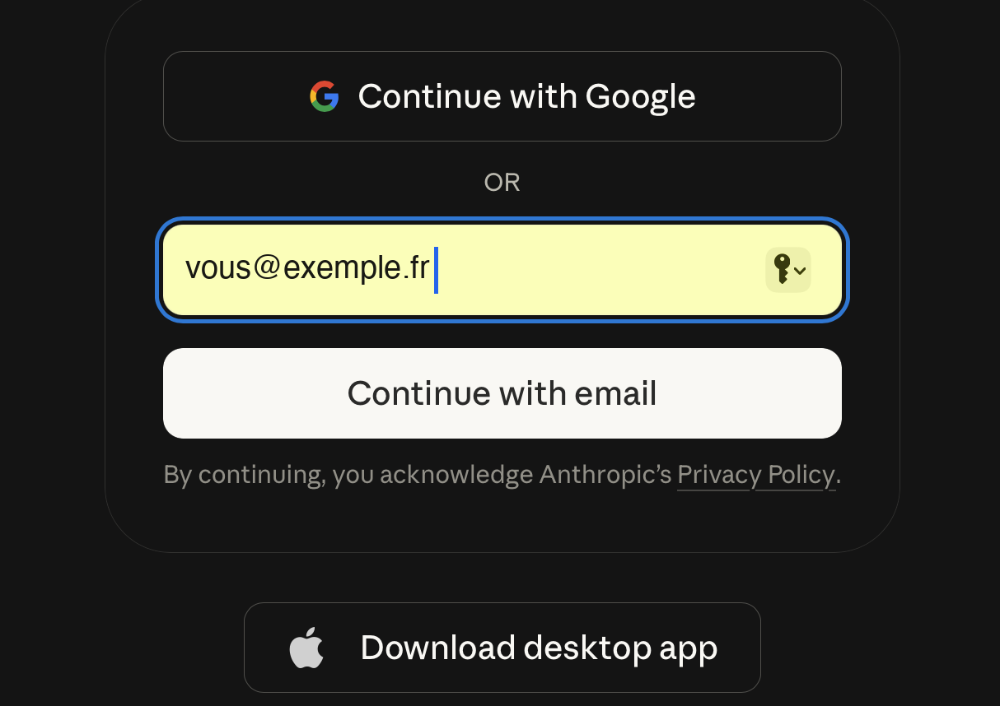
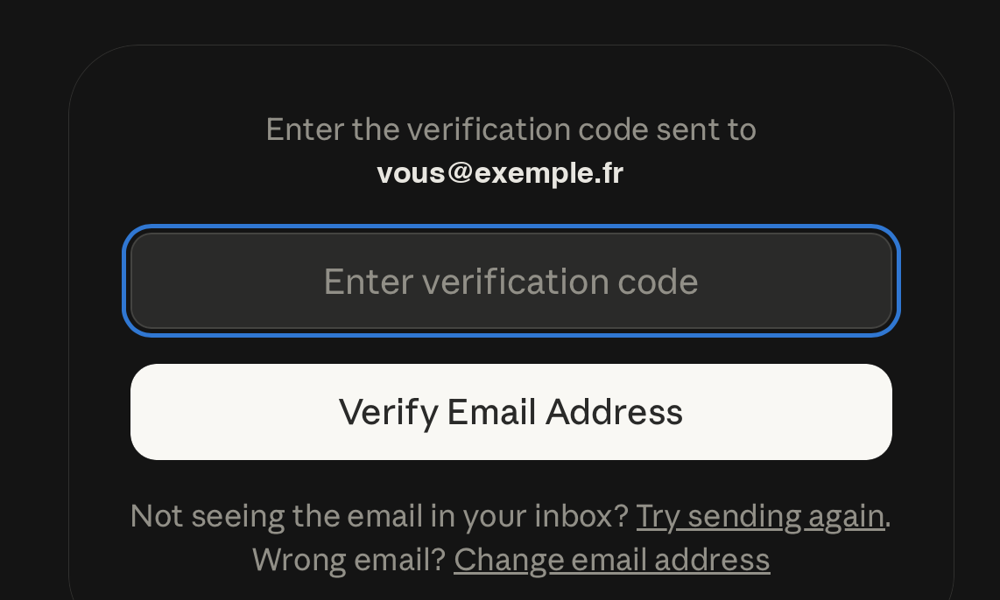
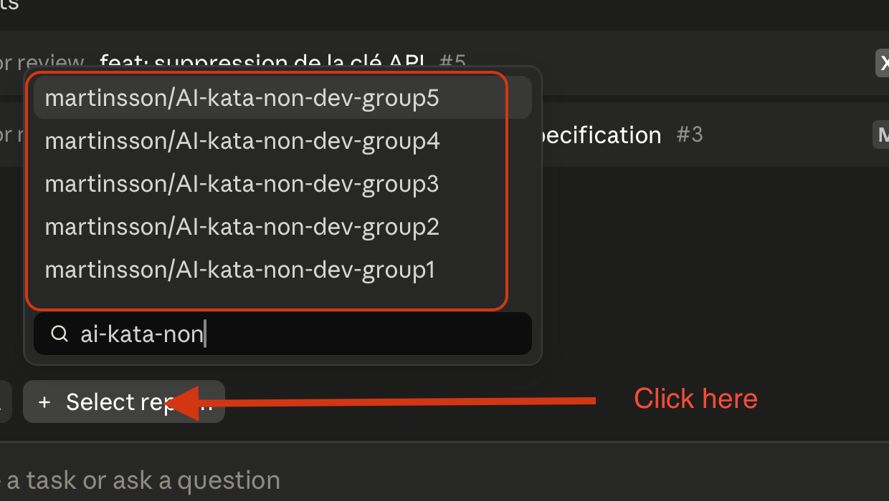
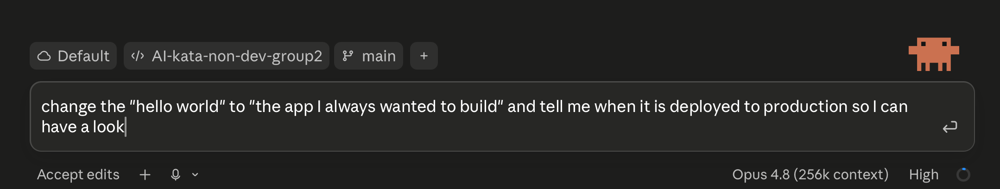

<!-- _class: lead -->
<!-- _paginate: false -->

# Faire une petite appli avec une IA, sans coder

Johan Martinsson & Jean Dupuis

---

# Au programme

- **Intro** — ce qu'on va faire et pourquoi
- **Méthode** — comment travailler avec l'IA
- **Hands-on** — vous codez (avec l'IA)
- **Démo & échanges**

---

# On va développer une petite appli

- Open data, visualisation
- Chatbot
- Dépôt de demande
- Votre rêve…

---

# Pratique

- Appli sur GitHub
- Claude sur web (compte de prêt)
- Open source

 

**Pour faire pareil chez vous :**
créez un compte GitHub + un compte Claude / Copilot / OpenAI

---

# Pourquoi faire faire une appli aux non-devs ?

- Prototyper pour mieux définir
- Se familiariser avec un workflow IA-first
- Découvrir
- Ne plus être bloqué par la difficulté de coder

---

<!-- _class: quote -->

## « Ce sera pas dans les règles de l'art. »

Pas grave — si le fonctionnel est prometteur, on refait le code proprement.

---

# Comment travailler avec l'IA

**1.** Décrire ce qu'on veut construire
**2.** Itérer avec l'IA — tester, ajuster, préciser
**3.** Valider le résultat

 

*L'IA génère, vous guidez.*

---

<!-- _class: procedure -->

# The procedure — step by step

<b>1.</b> Go to <a href="https://www.changit.fr/AI-kata-non-dev-group1/"><strong>www.changit.fr/AI-kata-non-dev-group<u>N</u></strong></a> (<u>N</u> = your group number)

<figure><figcaption><b>2.</b> Go to <strong>claude.ai/code</strong> and enter your email</figcaption></figure>
<figure><figcaption><b>3.</b> Get the <strong>verification code</strong> sent to your email</figcaption></figure>
<figure><figcaption><b>4.</b> Select the <strong>right project</strong> (your group)</figcaption></figure>
<figure><figcaption><b>5.</b> Ask for a change <strong>like this one</strong>:</figcaption></figure>

